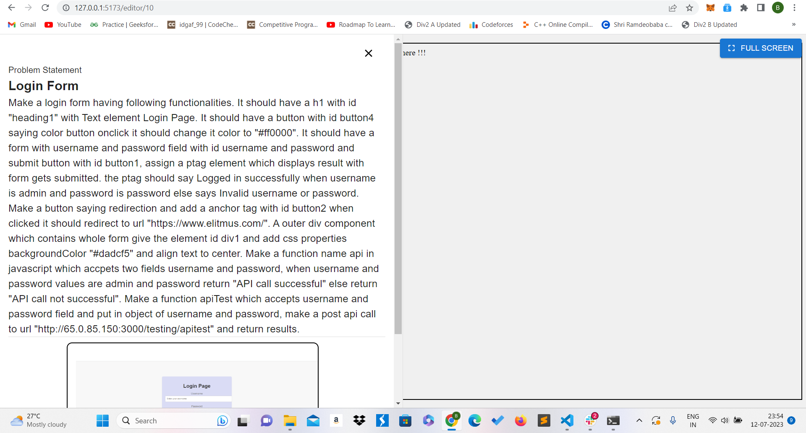

# Building a Frontend Scoring Engine: Automating Frontend Evaluation

## Introduction
The frontend scoring engine is a powerful tool designed to assess the frontend skills of candidates based on code quality, responsiveness, and functionality. This README.md file will delve into the technical aspects of developing a frontend scoring engine website, including its goals, features, technical requirements, and the tools and technologies involved.

---

## About the Project
The frontend scoring engine aims to streamline the evaluation process for frontend development by automating the assessment of code quality, best practices, and functionality. By allowing users to input HTML, CSS, and JavaScript code, and generating scores based on predefined test cases, the scoring engine provides a comprehensive evaluation of candidates' frontend skills.

---

## 🎯Objectives
The primary objective of this project is to develop a frontend scoring engine website that enables users to write and compile HTML, CSS, and JavaScript code. The engine will execute predefined test cases using frontend testing tools such as Jest, Cypress, or Selenium. By automating the evaluation process, the scoring engine will ensure efficient and accurate assessment of frontend development skills.

---

## 💻Technical Requirements
To successfully develop the frontend scoring engine, the following technical requirements must be met:

1. Testing:
   - Automated tests should be written for all features to ensure reliability and correctness.

2. Scalability:
   - The scoring engine should be capable of handling multiple requests simultaneously to accommodate a large number of users.

3. Coding Practices:
   - The codebase should be well-structured, following a modular architecture, to enhance maintainability and extensibility.
   - Best practices in linting should be followed by using ESLint to ensure code consistency and readability.

4. Security:
   - Frontend client-side code should incorporate security measures to prevent cross-site scripting (XSS) attacks.

5. Documentation:
   - The project should be thoroughly documented, providing clear instructions on system usage and configuration.
   - The documentation should include troubleshooting guidelines and solutions for common issues.

---

## 📝Research

Before starting the implementation of the frontend scoring engine project, extensive research was conducted to understand the need for such a system, gather requirements, evaluate existing systems, explore testing tools, and plan the evaluation process. This research phase played a crucial role in shaping the project and ensuring its successful execution. The following sections highlight the key areas of research conducted during the project's inception.

- **Understanding the Need** :
The initial research focused on identifying the need for a frontend scoring engine. The goal was to automate the evaluation process for frontend development and provide a comprehensive assessment of candidates' skills. This involved studying existing evaluation methods, such as manual code review and subjective assessments, to understand the limitations and inefficiencies of these approaches.

- **Requirement Gathering** :
A thorough understanding of the requirements was essential to design and develop an effective frontend scoring engine. This involved detailed discussions with stakeholders, including recruiters, frontend developers, and candidates. Requirements such as code compilation, test case execution, score calculation, and user-friendly interfaces were identified and documented.

- **Evaluating Existing Systems** :
To gain insights into the existing solutions available in the market, a comprehensive evaluation of similar systems was conducted. Various frontend scoring engines, online code editors, and testing frameworks were explored to understand their features, functionalities, strengths, and weaknesses. This evaluation provided valuable insights that influenced the design decisions and feature set of the new scoring engine.

- **Testing Tools and Technologies** :
Research was conducted to identify suitable testing tools and technologies for executing test cases, assessing code quality, and evaluating frontend functionalities. Tools such as Selenium, Cypress, and Jest were evaluated based on their capabilities, ease of use, and compatibility with the project requirements. After careful consideration, Puppeteer was chosen as the preferred testing tool due to its excellent compatibility with Docker and browser automation capabilities.

- **Puppeteer vs. Selenium** :
Puppeteer was chosen over Selenium primarily due to its compatibility with Docker and its ability to control headless Chrome or Chromium instances. Docker provides an efficient and scalable environment for running tests, and Puppeteer seamlessly integrates with Docker containers. Additionally, Puppeteer offers a more modern and concise API, making it easier to write test scripts and perform browser automation tasks.

- **Docker Integration** :
Research was conducted on Docker, a popular containerization platform, to understand its benefits and how it could be leveraged in the project. Docker allows for the creation and deployment of lightweight, portable, and isolated containers. The project utilized Docker to encapsulate and run the scoring engine, testing tools, and other dependencies in a consistent and reproducible environment.

Various Docker images were pulled from Docker Hub to set up the required tools. The project involved running these Docker images, mounting local volumes to the container, and executing the necessary tests and linting operations. The following command was used to run the Puppeteer image with a mounted local volume:

- eslint 
```console
foo@bar:~$ docker pull eeacms/jshint
foo@bar:~$ docker run -it --rm -v /path/to/javascript/code:/code eeacms/jshint
```

- csslint 
```console
foo@bar:~$ docker pull eeacms/csslint
foo@bar:~$ docker run --rm -v /path/to/javascript/code:/code eeacms/csslint
```

- puppeteer 
```console
foo@bar:~$ docker pull bhushan21z/puppchrome:v1.0
foo@bar:~$ docker run -it --rm -v $(pwd):/usr/src/app/files bhushan21z/puppchrome:v1.0
```

- **Real-Time Code Editor** :
To provide a user-friendly and real-time code editing experience, research was conducted on existing projects available on GitHub. Various code editor projects were evaluated, and their source code was studied to understand the implementation details. This research helped in selecting the most suitable code editor framework and implementing it within the frontend scoring engine.


- **Problem Statement and Test Case Creation** :
Extensive research was conducted to create effective problem statements and corresponding test cases. The goal was to design problem statements that accurately reflect real-world frontend development challenges and create test cases that thoroughly evaluate candidates' code. Puppeteer test scripts were written to simulate user interactions, perform assertions, and capture screenshots for image comparison using the PixelMatch JavaScript library.


- **Cloud Deployment and Infrastructure** :
Research was conducted on cloud deployment options, with a focus on Amazon Web Services (AWS) in this case. The research covered various AWS services, including EC2 instances for hosting the scoring engine, S3 for storage, and other relevant services for infrastructure setup. The deployment process, security considerations, and scaling options were thoroughly explored to ensure a robust and scalable deployment architecture.

---

## 📜Test Script Generation

In the frontend scoring engine, thorough testing is conducted to evaluate the user-submitted HTML, CSS, and JavaScript code against predefined test cases. This section provides an overview of the different types of tests performed and their significance in assessing the code quality, functionality, and adherence to best practices. Additionally, code snippets are provided to illustrate the testing process. For more detailed code examples, please refer to the provided link.

- **Heading/Element Testing**
This test focuses on ensuring the presence and correctness of specific HTML elements within the user's code. Test cases are designed to check if required headings, such as h1, h2, p or specific elements identified by ID or class, are present. The purpose of this test is to assess the structure and semantic correctness of the user's HTML code. 

- **CSS Properties Testing**
This test aims to verify the correct usage of CSS properties in the user's code. It includes checking for the presence of essential CSS properties, such as margin, padding, font-size, or specific properties required for a particular problem statement. This test ensures that the user's code adheres to the defined CSS requirements and best practices.

- **Form Validation Testing**
Form validation testing focuses on assessing the user's code for proper form validation techniques. Test cases can include checking for required fields, validating email formats, enforcing password complexity, or implementing custom validation logic. This test ensures that the user's code handles form validation correctly and provides appropriate error messages.

- **Function Testing**
This test evaluates the functionality and correctness of JavaScript functions implemented by the user. Test cases are designed to cover different scenarios and edge cases to ensure that the functions perform as expected. This test assesses the user's ability to write functional and efficient JavaScript code.

- **API Testing**
API testing involves verifying the integration of API calls in the user's code. Test cases may include checking if an API request is made, handling the API response correctly, and displaying the data from the API on the page. This test ensures that the user's code effectively interacts with external APIs.

- **Button Testing**
Button testing focuses on evaluating the behavior and interactivity of buttons implemented by the user. Test cases may include checking if a button triggers a specific action, updates the UI, or performs a navigation action. This test ensures the proper functionality of user-defined buttons.

- **Redirection Testing**
This test aims to assess the behavior of navigation and redirection implemented by the user's code. Test cases may include checking if clicking a link or a button redirects the user to the correct page or if the page refreshes as intended. This test ensures that the user's code correctly handles navigation and redirection scenarios.

---

## ✨Features List

### Scoring Engine
1. Inputs: The scoring engine takes HTML, CSS, and JavaScript files created by users on the client side, as well as the test cases file generated on the backend.
2. Code Quality Assessment: The engine assesses code quality using ESLint CSSlint and similar tools.
3. Scoring: The engine generates a score based on code quality, along with the results of the test cases executed on the client-side code.
4. Modular Architecture: The scoring engine is a separate entity, independent of the frontend and backend code.
5. Technology Stack: Python Flask framework is used to implement the scoring engine.
6. Flask runs various Docker run commands to execute test script.

### Backend
1. MySql Database: Schema Created with various tables such as users, questions, testcases and submissions.
2. Node JS: Express framework is used to implement Rest APIs.
2. User auth: Contains user register and login APIs.
3. Questions: Questions create/get APIs.
4. Test Cases: Testcases create/get APIs and joining it with Questions table with question id as foreign key.
5. Scoring Engine: POST request to get user data and sending it to scoring engine and returning scoring engine response to frontend.
6. Submissions: User Submissions create/get APIs and joing it with users table and questions table.


### Frontend (Admin Side)
1. Problem Creation: Admins can create problem statements, describing the problem to be solved.
2. Problem Settings: Problems can include various settings such as score weightage, best practices to check, and mobile responsiveness evaluation.
3. Test Cases: Admins can add multiple test cases related to each problem statement.
4. Test Case Visibility: Some test case outputs will be visible to users, while others will be hidden, showing only whether the score passed or failed.
5. User-Friendly Test Case Creation: Adding test cases are straightforward, even for users with limited programming knowledge.


### Frontend (Client Side)
1. Problem List: Users can view a list of problems on their screen.
2. Code Editor: Users can write HTML, CSS, and JavaScript code for each problem, similar to the CodePen editor.
3. Code Compilation: Users can compile their code and generate the output.
4. Score Display: Users can view the scores generated by the scoring engine based on the performed test cases.

---

## 📸 Screenshots


<div style="display:flex; flex-direction:row; margin-bottom:20px">
</img>
</img>
</div>

<div style="display:flex; flex-direction:row">
</img>
</img>
</div>

<div style="display:flex; flex-direction:row">
</img>
</img>
</div>
---

## ⚒️ Tools & Technologies

### Frontend
- ReactJS is used develop the frontend of the scoring engine.

### Backend
- Node.js is employed for building the backend of the scoring engine.
- MySQL is used as the database management system.

### Scoring Engine
- Puppeteer is used for implementing testcases and browser testing.
- Docker containers are utilized for testing code quality and running test cases.

## Conclusion
By implementing a frontend scoring engine, frontend development evaluation can be automated, resulting in a streamlined and efficient assessment process. This README.md file has explored the goals, features, technical requirements, and tools and technologies involved in developing a frontend scoring engine. With proper planning and utilization of the recommended tools and technologies, you can create a powerful scoring engine to evaluate candidates' frontend skills accurately and comprehensively.
